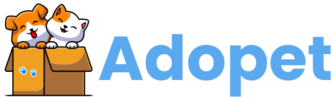

<div align="center">
   
   <br />
</div>


## 💻 Projeto

Projeto desenvolvido para a faculdade, aonde o objetivo principal era desenvolver um API em Java e depois consumir no front-end.

O projeto em sí, tem a finalizade de adoção de pets abandonados, aonde uma pessoa cria o anúncio do pet na parte da web e na parte do mobile é possível adotar.

## 🛠️ Features

- [ ] Cadastrar usuário
- [ ] Criar Pet para adoção
- [ ] Adotar Pet
- [ ] Favoritar Pet
- [ ] E mais...

## ✨ Tecnologias

- [ ] React
- [ ] React Native
- [ ] Typescript
- [ ] Styled Components
- [ ] Expo
- [ ] Spring Boot

## 🔖 Layout

Você pode visualizar o layout do projeto através [desse link](https://www.figma.com/file/N6IKITAT5J5xqL71NVU2Ao/Adopet?node-id=477%3A2105&t=SyociAjY94aLEwz6-1). É necessário ter conta no [Figma](http://figma.com/) para acessá-lo.

## Executando o projeto

Utilize o **yarn** ou o **npm install** para instalar as dependências do projeto.
Em seguida, inicie o projeto.

```cl
 git clone https://github.com/rodrigocelvo/adopet.git
 cd adopet
 yarn ou npm install
```

Back-end:

```
 No arquivo .env configure o usuário e senha do seu banco de dados.
```

## 🤔 Como contribuir

- Faça um fork desse repositório;
- Cria uma branch com a sua feature: `git checkout -b minha-feature`;
- Faça commit das suas alterações: `git commit -m 'feat: Minha nova feature'`;
- Faça push para a sua branch: `git push origin minha-feature`.

Depois que o merge da sua pull request for feito, você pode deletar a sua branch.

<div align="center">
 Feito com 💜  by Rodrigo Celvo
</div>
